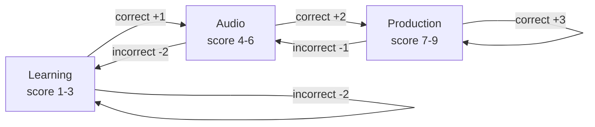
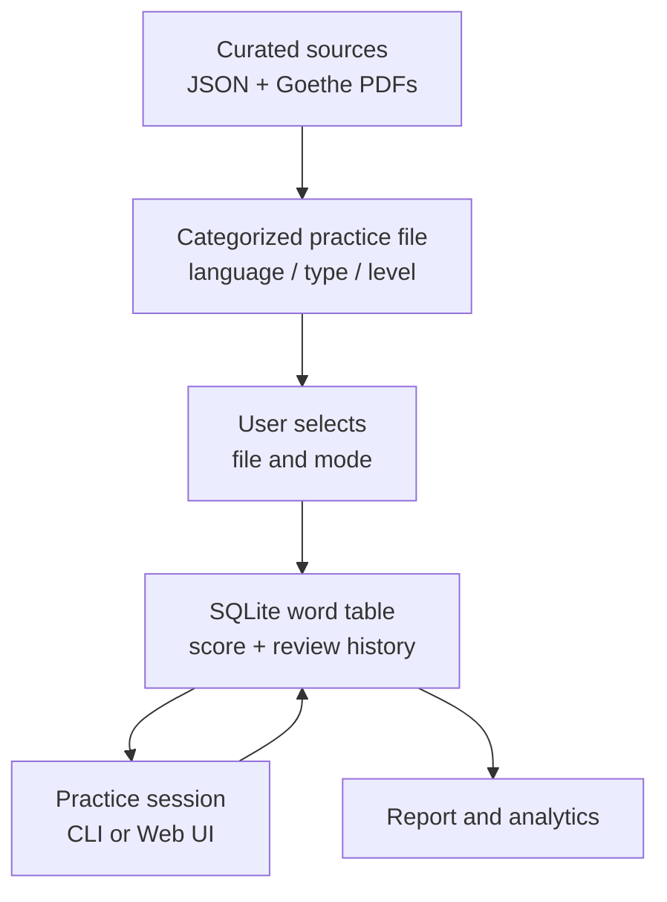

# Tartarus

Tartarus is a local-first language practice system for deliberate vocabulary
and sentence recall. It combines an adaptive scoring model, Leitner review
intervals, audio practice, and focused drill modes in one compact workflow.

The command-line interface and self-hosted web UI share the same SQLite
database and scoring engine, so practice history is consistent whichever
interface you use. The bundled datasets support **English and German** and
cover categorized vocabulary and sentence lists from A1 through C2.

### Why Tartarus

| Capability | Purpose |
|---|---|
| Adaptive question bands | Move from recognition to audio recall to production as confidence grows. |
| Spaced repetition | Keep mastered words on a five-box Leitner schedule. |
| Targeted review | Revisit mistakes, known words, or mastered words in fast mode. |
| Local ownership | Keep the database, datasets, and practice history on your machine. |
| Two interfaces | Use the terminal for speed or the web UI for visual progress and setup. |

## The Learning Loop

Each vocabulary entry moves through question bands based on its current score:



The score is capped at `9.0` and floored at `1.0`. Once mastered, an entry
is scheduled by its Leitner box instead of being repeatedly shown the same
day.

## Quick Start

Use the Makefile for the normal workflows:

```bash
make help
make web
```

`make web` starts the UI at <http://127.0.0.1:9999/>. The server binds to
localhost only.

For CLI practice:

```bash
make practice user=your_name list=german_a1_goethe opts="--no-audio"
```

The `user` and `list` variables are required for `practice` and `init`.
Optional CLI flags are passed through `opts`.

## Make Commands

| Command | Purpose |
|---|---|
| `make help` | Show the available commands. |
| `make web` | Start the local web UI. |
| `make practice user=<name> list=<file>` | Start CLI practice. |
| `make report user=<name> [list=<file>]` | Show a report for one file or the whole user. |
| `make init user=<name> list=<name>` | Create an empty user word list and database tables. |
| `make video opts="<options>"` | Generate an optional vocabulary video. |

Examples:

```bash
make practice user=your_name list=german_a1_nouns_masculine opts="--audio-lang german"
make practice user=your_name list=german_a1_goethe opts="--fast --no-audio"
make report user=your_name
make report user=your_name list=german_a1_goethe
make init user=your_name list=my_custom_list
```

## Word Lists

Shared practice files are organized by language, type, and CEFR level:

```text
data/word_lists/
  english/
    vocabulary/<a1-c2>/english_<level>_<part_of_speech>.json
    sentences/<a1-c2>/english_sentences_<level>_<part_of_speech>.json
  german/
    vocabulary/<a1-c2>/german_<level>_<category>.json
    sentences/<a1-c2>/german_sentences_<level>_<category>.json
```

Examples:

```text
data/word_lists/german/vocabulary/a1/german_a1_nouns_masculine.json
data/word_lists/german/sentences/a1/german_sentences_a1_verbs.json
data/word_lists/english/vocabulary/b2/english_b2_verbs.json
```

The web UI discovers these files automatically. Select a user, language type,
level, and file. Each file option displays its number of entries.

The raw source datasets are intentionally kept out of the selectable list:

```text
data/sources/english.json
data/sources/german.json
data/sources/goethe/*.pdf
```

The Goethe PDFs are retained as source material for the Goethe vocabulary
lists. Source files are not practice files themselves.

### JSON schema

Word and sentence files are JSON arrays. Each item uses `word` and an optional
`definition`:

```json
[
  {
    "word": "das Haus, die Häuser",
    "definition": ["house, building"]
  },
  {
    "word": "Er wohnt in einem Haus.",
    "definition": ["He lives in a house."]
  }
]
```

`definition` may be a string or an array of strings. A word may contain
comma-separated accepted forms, such as a German singular and plural. Answers
are matched against the accepted forms. German nouns should include their
article and plural form.

Vocabulary records may also include the optional integer `word_frequency`.
When it is present, normal practice introduces higher-frequency entries first,
then proceeds toward lower-frequency entries. Entries without a frequency are
placed after entries with a frequency.

Sentence files are treated differently from vocabulary files:

- The sentence itself is the text the learner types.
- Sentence practice advances one level per correct answer, from score 0 to 9.
- A sentence must be typed correctly nine times to reach mastery.
- An incorrect sentence answer is retried immediately.
- Sentence practice does not use mistake, known, instant, drill-all, or other
  drill modes.

## Scoring And Review

Each vocabulary entry has a score from `1.0` to `9.0`:

| Score | Question | Correct answer | Incorrect answer |
|---|---|---:|---:|
| 1-3 | Learning: word and definition are shown | `+1` | `-2` |
| 4-6 | Audio: listen and type the word | `+2` | `-2` |
| 7-9 | Production: definition and audio, type from memory | `+3` | `-1` |

Scores are capped at `9.0` and floored at `1.0`. Words at score 9 use a
five-box Leitner schedule:

| Box | Review interval |
|---|---|
| 1 | 1 day |
| 2 | 2 days |
| 3 | 4 days |
| 4 | 9 days |
| 5 | 14 days |

An incorrect vocabulary answer resets its Leitner box. Idle non-mastered
words decay by one score point per idle day. Practice sessions record duration,
word count, correct and incorrect answers, drills, and review timestamps.

### Review modes

The web UI presents these as switches. The equivalent CLI flags are:

| Mode | CLI flag | Behavior |
|---|---|---|
| Fast mode | `--fast` | Review mastered words in oldest-fast-review order. A wrong answer stays on the same word until it is correct. Scores are unchanged; mistakes lower the session accuracy. |
| Mistake drill | `--drill-mode` | Review words with the highest mistake counts. Scores are unchanged. |
| Known drill | `--known-drill-mode` | Review mastered words from never reviewed to oldest known review. A known-drill prompt hides the answer and shows only the definition/audio. |
| Instant drill | `--instant-drill` | An incorrect vocabulary answer immediately starts that word's drill. |
| Drill all | `--drill` | Put every selected vocabulary word through drill. |

Only one drill mode can be active at a time. Fast mode cannot be combined with
a drill mode. Sentence files disable drill switches automatically.

Fast-mode sessions are logged as practice time and review activity. Fast mode
also stores the last fast-review timestamp so a later fast session continues
from the oldest not-yet-reviewed mastered word rather than restarting at the
beginning.

## How Data Becomes Practice

Shared source data is separated from the smaller files exposed in the UI. The
backend discovers files by their language, practice type, and CEFR directory,
then synchronizes the selected file into the user's database tables.



### In-session commands

The CLI supports these commands while practicing. The web UI exposes the
corresponding actions as buttons where applicable:

| Command | Behavior |
|---|---|
| `!!` or `Ctrl+C` | End the session and save it. |
| `?` | Reveal or repeat the current word/audio. |
| `+` | Replay audio. |
| `!` | Flag the current word for more practice. |
| `@` | Mark the current word known/mastered. |
| `$` | Start the current word's nine-repetition drill. |

After an answer is submitted in the web UI, the input is locked until the
server returns a result. Pasting into answer fields is disabled; copying is
allowed.

## Web UI

The Practice page uses this setup flow:

1. User
2. Audio language and speech WPM
3. Language type: English/German vocabulary or sentences
4. CEFR level
5. Word-list file
6. Audio and review-mode switches

The Report page uses the same compact cascade. Selecting only a user loads the
full user report. Selecting a language, level, and file loads focused history,
analytics, word statistics, and Leitner data for that file.

The Word Lists page shows discovered files and their paths. The About page
contains the application overview. All pages use the same local API and
database as the CLI.

## CLI Options

Detailed options are available from the underlying script:

```bash
python3 utils/tartarus.py practice --help
python3 utils/tartarus.py report --help
python3 utils/tartarus.py init --help
```

Practice options include:

```text
--no-audio
--audio-lang <language>
--fast
--drill
--drill-mode
--instant-drill
--known-drill-mode
--wpm <30-400>       default: 128
```

## Project Structure

```text
Makefile                  Make-based entry points
utils/tartarus.py         CLI and shared scoring/database logic
utils/tartarus_web.py     Local HTTP server and web API
utils/make_tartarus_video.py
web/index.html            Web UI markup
web/app.js                Web UI behavior
web/style.css             Web UI styling
data/tartarus.db          Local SQLite history database
data/sources/             Raw JSON sources and Goethe PDFs
data/word_lists/          Selectable categorized practice files
```

The database is created and updated locally as needed. It is not a source
dataset and should be backed up before any manual database maintenance.

## Audio

On macOS, audio uses the built-in `say` command and is enabled by default.
Use `--no-audio` for a silent CLI session. The web server uses the same server-
side audio mechanism when audio is enabled. On systems without macOS `say`,
practice continues without audio.

For German, use `--audio-lang german` when practicing a sub-list identifier
whose name does not make the language obvious:

```bash
make practice user=your_name list=german_a1_nouns_masculine opts="--audio-lang german"
```

## Optional Video Tool

`utils/make_tartarus_video.py` creates a vocabulary-review video independently
of the database:

```bash
make video opts="--user your_name --lang german_a1_goethe --number 5"
```

It requires `ffmpeg` with the `drawtext` filter and, on macOS, `say` for audio.
Check the video tool's help for all options:

```bash
python3 utils/make_tartarus_video.py --help
```

## Requirements

- Python 3
- Standard library only for Tartarus itself
- macOS `say` is optional and provides audio
- `ffmpeg` with `drawtext` is required only for the optional video tool
