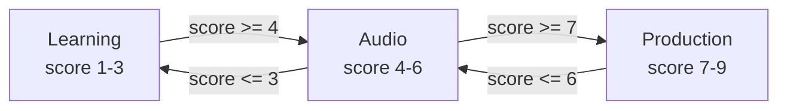
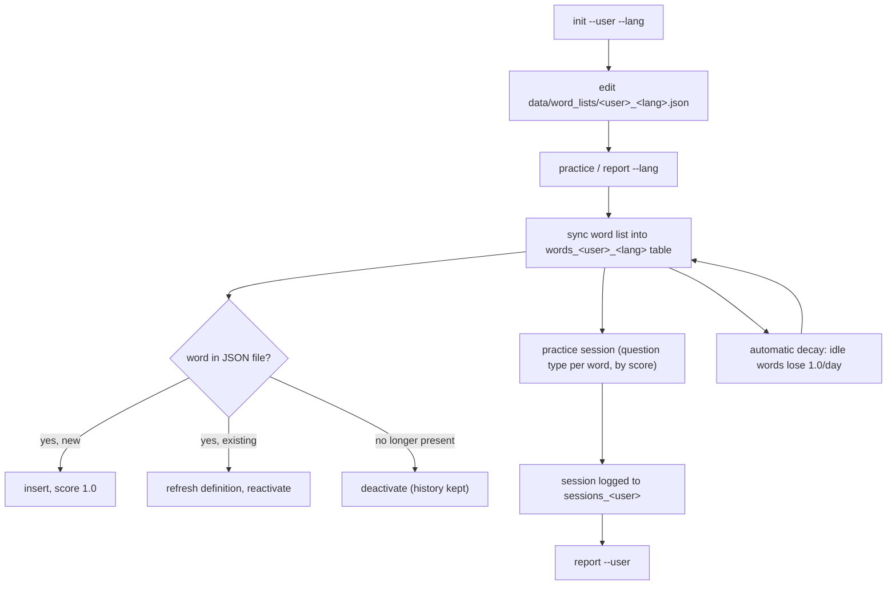

# Tartarus

A vocabulary practice tool with a **command-line interface** and a
**self-hosted web UI**, backed by a local SQLite database and a
spaced-repetition scoring system. Tartarus is **language-agnostic and
multi-user**: any user can maintain any number of word lists (one per
language or topic), each entry being a word plus an optional definition (or
multiple definitions, in any language). For example, an English word can have
both an English and a German definition, and vice versa — handy if you're
practicing a new language while reviewing in your own.

## How it works

- All data lives in a single local SQLite database (`data/tartarus.db`).
- Each **user** has their own tables, and each **word list** (one per
  `--lang`) is its own table: `words_<user>_<lang>`.
- Every word has a **score** from `1.0` (struggling) to `9.0` (mastered),
  plus history counters (`times_practiced`, `times_correct`,
  `times_incorrect`, `times_drilled`, `times_flagged`, `times_mastered`).
- There's a single `practice` command. Each word's *current score* decides
  what kind of question it gets, Memrise-style — so a session over a mix of
  new and practiced words naturally mixes all three question types:

| Score | Gauge | Question type | On correct | On incorrect |
|---|---|---|---|---|
| 1-3 | `○○○` | **Learning** — word + definition(s) shown, type the word | `+1` | `-2` |
| 4-6 | `●○○` | **Audio** — listen only, type the word you hear | `+2` | `-2` |
| 7-9 | `●●○`/`●●●` | **Production** — definition shown + audio plays, type the word from memory | `+3` (capped at 9.0) | `-1` |

Scores are floored at `1.0`. A word with no definition always uses the
flash-and-hide spelling test for "Learning", and the listening test for
"Production" (since there's no definition to show), but still earns/loses the
points for whichever band it's in.



A correct answer adds points (+1 in Learning, +2 in Audio, +3 in Production,
capped at 9); an incorrect answer subtracts 2 in Learning/Audio or 1 in
Production (floored at 1) — see the table above. Either can move a word into
a neighboring band. Manual overrides jump straight to a band regardless of
score: `@` master -> 9.0 (Production), `$` drill -> 5.0 (Audio), `!` flag ->
1.0 (Learning).

- Every word left untouched for **one or more days automatically loses 1.0
  point per idle day** (floored at `1.0`), pulling neglected words back into
  easier question types — this happens automatically on every `practice`/
  `report --lang` run, no separate command needed.
- Every session is logged (date, duration, words practiced, correct/incorrect,
  drilled count) so you can review your history with `report`.

## How learning works

Tartarus combines two complementary systems to build long-term retention.

### Score and question bands

Every word carries a score from `1.0` (new/struggling) to `9.0` (mastered).
Each practice answer moves the score up or down (see the table in [How it
works](#how-it-works)), which in turn may shift the word into a harder or
easier question band. The goal of each session is to push as many words as
possible to score `9.0`.

### Leitner spaced repetition (5-box system)

Once a word is mastered (score = 9.0) it enters a **Leitner box** that
controls how often it comes back for review:

| Box | Review interval |
|---|---|
| Box 1 | every 1 day |
| Box 2 | every 2 days |
| Box 3 | every 4 days |
| Box 4 | every 9 days |
| Box 5 | every 14 days |

- A word **advances one box** only when its score reaches exactly `9.0`
  (mastery). Intermediate correct answers raise the score but leave the box
  unchanged.
- An **incorrect answer** resets the box to 1, so the word returns to daily
  review until it's mastered again.
- All new words start in Box 1. The box persists across sessions, so a word
  you mastered last week might not appear today if its review interval hasn't
  elapsed.

The `report --lang` command shows the current box distribution and how many
words are due today. The web UI word-list table shows each word's box and its
next scheduled review date.

### Session word priority

Each session picks **up to 16 unique words**, each asked exactly once.
Priority order within a session:

1. **In-progress words** (score < 9) that are new, were practiced earlier
   today, or are Leitner-due — ordered by **score descending** (closest to
   mastery first). The same word can appear across multiple sessions on the
   same day until it reaches score 9, because the day-goal is to maximise
   the number of words that cross the mastery threshold.
2. **Mastered words** (score = 9) whose Leitner interval has elapsed — review
   filler, oldest review first.
3. **Not-yet-due** words — last resort if the word list is very short.

### Drill mode — fixing your worst mistakes

Running with `--drill-mode` (or clicking **Drill** in the web UI) launches a
targeted mistake-correction session:

- The **10 words with the most recorded incorrect answers** are selected.
- Every word goes through a **9-correct-in-a-row** repetition drill —
  regardless of its score band — so you build real muscle memory, not just
  momentary recall.
- After completing the drill for a word, **one incorrect mark is erased**
  from its history (`times_incorrect - 1`). Run the drill session again to
  erase another, gradually clearing the record of words you've fixed.
- Scores are never changed in drill mode; only `times_drilled` and
  `times_incorrect` are updated.

### Practice streak

Every session is counted toward a **practice streak**. The `report` command
(CLI and web UI) shows your current consecutive-day streak and your personal
best. Practicing on any number of sessions in a day counts as one day toward
the streak.

## Setup

Tartarus has no external dependencies. Use `make help` to see its normal web
and CLI entry points.

```bash
make help
```

### Create a word list for a user/language

```bash
make init user=bahman list=german
```

This creates `data/word_lists/bahman_german.json` (an empty array) and the
corresponding tables in `data/tartarus.db`. Edit the JSON file to add words,
then practice.

## Word list format

Each word list is a JSON array of `{word, definition}` objects, stored at
`data/word_lists/<user>_<lang>.json`:

```json
[
  { "word": "Haus", "definition": ["house, building", "ein Gebäude zum Wohnen"] },
  { "word": "laufen", "definition": "to run, to walk" },
  { "word": "Apfel" }
]
```

- `word` — required, the term to practice. You can give **multiple accepted
  forms** by separating them with commas, e.g. `"das Haus, die Häuser"`
  (singular + plural). All forms are shown/spoken together, and an answer is
  marked correct if it matches *any single form*, **or** if you type out all
  the forms together in any order — spacing around the commas doesn't
  matter (`"a, b"`, `"a,b"` and `"a , b"` are all equivalent), and
  matching is case-insensitive.
- `definition` — optional. Can be a single string, a list of strings (each
  shown on its own line), or omitted entirely for plain spelling practice.
  Definitions can be in any language(s) you like — there's no fixed pairing.

> **Note:** the "Learning" and "Production" question types only do anything
> useful for words that *have* a non-empty `definition`. A word with no
> definition always falls back to the plain flash-and-hide spelling test for
> "Learning", and to the listening test for "Production" (no definition to
> show). For the best experience, give every word at least one definition.

Sample lists are included for user `bahman`. A single user can have as many
word lists as they like — the `--lang` value (or **Word list** field in the
web UI) is just a label, not a fixed language name. Use any name that makes
sense to you (e.g. `german_home`, `english_b2`).

**Starter lists (hand-curated):**
- `data/word_lists/bahman_english.json` — 20 A1 English words with
  English-only definitions.
- `data/word_lists/bahman_german.json` — 20 A1 German words (with articles
  and plural forms) and English definitions.

**Generated from the Language Learning decks**
([github.com/vbvss199/Language-Learning-decks](https://github.com/vbvss199/Language-Learning-decks)):

| Source file | Total records | Translation | CEFR | Sentences |
|---|---|---|---|---|
| `german.json` | 20 280 | 100 % | 100 % | 100 % |
| `english.json` | 20 708 | 100 % | 100 % | — |

Entries without a valid CEFR level (A1–C2) are skipped by the generator; the rest are split one file per level.

**German vocabulary** (`german_<category>_<level>.json`) — word + `der`/`die`/`das` for nouns, English translation, and bilingual example sentence. Nouns are split by gender; other entries are split by part of speech.

| Level | Source records | Sentence records |
|---|---|---|
| A1 | 675 | 678 |
| A2 | 2 055 | 2 056 |
| B1 | 6 440 | 6 445 |
| B2 | 8 282 | 8 280 |
| C1 | 2 770 | 2 770 |
| C2 | 31 | 31 |

**English vocabulary** (`english_<category>_<level>.json`) — word + definition:

| Level | Words |
|---|---|
| A1 | 634 |
| A2 | 1 694 |
| B1 | 4 667 |
| B2 | 8 549 |
| C1 | 4 857 |
| C2 | 307 |

Regenerate any of these with `utils/generate_tartarus_json.py` — see
[Generating word lists from the source decks](#generating-word-lists-from-the-source-decks) below.

All sub-list names (`german_a1`, `english_b1`, etc.) don't auto-detect as a
language for audio. Always pass `--audio-lang` (CLI) or fill **Audio language**
(web UI):

```bash
make practice user=bahman list=german_nouns_masculine_a1 opts="--audio-lang german"
```

## Generating word lists from the source decks

Raw source files in `data/sources/` come from
[github.com/vbvss199/Language-Learning-decks](https://github.com/vbvss199/Language-Learning-decks).
The Goethe PDFs are stored in `data/sources/goethe/`. Replace a source file and
re-run `utils/generate_tartarus_json.py` when the source data changes.

Supported source files: `data/sources/german.json`, `data/sources/english.json`.

```bash
python3 utils/generate_tartarus_json.py --all
```

The generator creates category and CEFR files directly in `data/word_lists/`.
German files include matching sentence files, for example:

- `german_nouns_masculine_a1.json`
- `german_nouns_masculine_sentences_a1.json`
- `german_verbs_b1.json`
- `german_verbs_sentences_b1.json`

Each generated record may include `word_frequency`. Lower frequency ranks are
more common, and the practice backend uses them to prioritize common words.

Sentence files use the native sentence as `word` and its English translation as
`definition`.
- **word** — native sentence (e.g. `"Er will Arzt sein."` / `"彼は良い人です。"`)
- **definition** — English translation (e.g. `"He wants to be a doctor."`)

Each native sentence is paired with its own English translation from the same
source record, so the mapping is always exact.

## Renewing word lists

Every time you run `practice` or `report --lang <lang>`, Tartarus "renews"
that list from its JSON file:

- New entries are added to the table (score `1.0`, fresh history).
- Existing entries have their definitions refreshed.
- Entries removed from the JSON file are **deactivated** (excluded from
  future practice) but their score and history counters are kept — if you
  add the word back later, its history picks up where it left off.



## Commands

### Practice

```bash
make practice user=bahman list=german
```

| Option | Description |
|---|---|
| `--user <name>` | Required. Username (lowercase letters, digits, underscores). |
| `--lang <name>` | Required. Which word list to practice (the full list identifier, e.g. `german_home`). |
| `--no-audio` | Disable speaking each word aloud. On **macOS**, audio (via `say`) is **on by default**; this flag turns it off. Has no effect on other platforms, where audio is never available. |
| `--audio-lang <lang>` | Override the language used for voice/TTS selection. Useful when `--lang` is a sub-list name like `german_home` that doesn't auto-detect as German: pass `--audio-lang german` to use the German `say` voice regardless. Accepts the same values as `--lang` (e.g. `german`, `de`). |
| `--drill` | Full drill: every word in the session goes through the 9-repetition drill automatically, regardless of its score band. |
| `--drill-mode` | Mistake drill: selects the 10 words with the most incorrect answers and puts each through a 9-correct-in-a-row repetition. On success, one incorrect mark is removed from that word's history. Scores are not changed. |

Run `make help` to see the available web and CLI commands. Add optional CLI
flags with `opts`, for example:

```bash
make practice user=bahman list=german opts="--no-audio"
```

#### In-session commands

| Command | Effect |
|---|---|
| `!!` | End the session early and save progress |
| `Ctrl+C` | End the session early and save progress |
| `?` | Repeat: see the word again or replay its audio |
| `+` | Replay the current word's audio |
| `!` | Flag the current word as difficult (score → `1.0`) |
| `@` | Mark the current word as known/mastered (score → `9.0`) |
| `$` | Start a strict 9-repetition drill for the current word (score → `5.0`) |

### Report

```bash
make report user=bahman [list=german]
```

| Option | Description |
|---|---|
| `--user <name>` | Required. Username. |
| `--lang <name>` | Optional. Limit the report to a single word list. Omit to see a separate report for each of the user's word lists. |

- **Without `--lang`**: shows a cross-language **user overview** — daily
  sessions, languages, time, words practiced, accuracy, and average
  seconds-per-word — followed by a per-language breakdown. Your current and
  best practice streaks are shown at the top.
- **With `--lang`**: shows the per-language table plus the Leitner box
  distribution and due-today count for that word list.

### Init

```bash
make init user=bahman list=german
```

| Option | Description |
|---|---|
| `--user <name>` | Required. Username. |
| `--lang <name>` | Required. Language / word list name. |

Creates an empty word list JSON file and its tables for a user/language, if
they don't already exist.

### Help

Use the Makefile for the normal workflows:

```bash
make help
```

The underlying CLI still provides detailed flag help when needed:

```bash
python3 utils/tartarus.py practice --help
python3 utils/tartarus.py report --help
python3 utils/tartarus.py init --help
```

## Project structure

```
utils/tartarus.py          # main script (single file)
utils/tartarus_web.py     # web server (JSON API + static frontend)
Makefile                  # normal web and CLI entry points (`make help`)
utils/
  make_tartarus_video.py         # standalone: generate a vocab-drill video
  generate_tartarus_json.py   # generate word lists from source decks
web/
  index.html              # frontend markup
  style.css               # Catppuccin Mocha dark theme
  app.js                  # frontend logic
data/
  tartarus.db             # SQLite database (auto-created)
  sources/
    german.json           # raw German source deck
    english.json          # raw English source deck
    goethe/               # authoritative Goethe PDFs
  word_lists/
    german_<category>_<level>.json
    german_<category>_sentences_<level>.json
    english_<category>_<level>.json
    <user>_<lang>.json    # generated / hand-curated word lists
```

## Web UI

Tartarus also ships with a localhost-only web UI that uses the same
SQLite database and scoring logic as the CLI - standard library only, no
`pip install` or virtualenv needed.

```bash
make web
```

This starts a server at **http://127.0.0.1:9999/** (bound to localhost
only). Open it in a browser for:

- **Practice** - the same Learning/Audio/Production question types and growth
  gauge as the CLI, with the same special commands available as buttons
  (`!!` end, `!` flag, `@` master, `$` drill, `?` reveal, `+` replay audio).
  Audio is played via macOS `say` on the server side — the same system
  voice (including Siri voices) as the CLI, so there is no browser
  limitation on voice quality.
- **Report** - without a language filter: a user-level overview of all
  sessions across every language (daily stats, accuracy, avg time per word,
  streak). With a language: the per-language daily table plus the full word
  list with each word's score, Leitner box, next scheduled review date, and
  per-word practice stats (times practiced, correct, incorrect, drilled,
  flagged, mastered).
- **Word Lists** - see existing `<user>_<lang>` word lists, create new ones
  (equivalent to `init --user --lang`), and edit a list's words and
  definitions directly in the browser - saved straight to
  `data/word_lists/<user>_<lang>.json` and re-synced into the database.
- **About** - an overview of the project and how the CLI and web UI share
  the same database as their single source of truth.

Every page's main button doubles as the `Enter` key shortcut on its input
fields, and pressing `Enter` with a required field empty moves focus there
instead of submitting.

The theme is dark, using the
[Catppuccin Mocha](https://catppuccin.com/palette/) palette.

## Audio / pronunciation (macOS)

On macOS, every word is spoken aloud via the built-in `say` command —
enabled by default, disable with `--no-audio`.

- Tartarus picks a `say` voice matching `--lang` when one is installed
  (e.g. a German voice for `--lang german`), so words are pronounced in
  their own language rather  than read with the system default voice's accent. If no matching voice is
  found, the system default voice is used.
- **English** (`--lang english`/`en`) always uses the **system default
  voice** — no `-v` override is applied.
- **German** (`--lang german`/`deutsch`/`de`) prefers the best installed
  "Anna" variant, in order: `Anna (Premium)` > `Anna (Enhanced)` > `Anna`.
  Whichever of these is installed (check with `say -v '?' | grep -i anna`)
  is used.
- For unsupported `--lang` values, Tartarus falls back to the system default
  voice.
- Recognized `--lang` names for voice matching are `english`, `german`,
  `deutsch`, `en`, and `de`. Any other `--lang` value still works for
  practice — it just falls back to the default voice for audio.
- **A note on voice quality:** macOS's System Settings -> Accessibility ->
  Spoken Content "Voice 1-4" picks (Siri/personal voices) are *not*
  addressable by name from the command line. This is different from
  downloadable premium voices like `Anna (Premium)`, which **are**
  addressable via `say -v "Anna (Premium)"` and are what Tartarus uses for
  German when installed.
- During the `$` 9-repetition drill, the word is spoken before **every**
  repetition, not just once — useful for repeated listen-and-spell practice.
- In the "Learning" and "Audio" question types, the word is spoken when the
  prompt appears (before you answer); pressing `?` replays the audio and
  briefly shows the word on screen, in case you need to look at it.

## Color-coded German genders

For words that start with a German article, Tartarus colors the word
according to its grammatical gender wherever it's displayed:

| Article | Gender | Color |
|---|---|---|
| `der ...` | masculine | blue |
| `die ...` | feminine | red |
| `das ...` | neuter | green |
| (no article / verbs, adjectives, other languages) | — | green |

> **Tip:** as any good German teacher will tell you, always learn a noun
> *together with* its article (`der`/`die`/`das`) and its plural form —
> guessing the gender or plural later is much harder than memorizing them
> from the start. To take advantage of this, write your German nouns in
> `word_lists/<user>_german.json` with the article included, and add the
> plural form as a second, comma-separated form in the same `word` field
> (e.g. `"das Haus, die Häuser"`). Both forms are shown and spoken together,
> and typing either one (singular or plural) counts as correct. The bundled
> `bahman_german.json` list is set up this way as an example, and the color
> coding above will then show you the gender at a glance during practice.

## Requirements

- Python 3 (standard library only, no external dependencies)
- macOS gets spoken-word audio for free (via the built-in `say` command),
  enabled by default. Use `--no-audio` to turn it off. On Linux/Windows,
  audio is simply unavailable (the flag has no effect either way).

## Everyday practice commands

The `list` variable switches the whole session between word lists — use
`list=german` or `list=english` (or any other list you've `init`'d) with any
of the commands below. There's just one command: `practice`. The
question type for each word is chosen automatically from its score (see
[How it works](#how-it-works) above), so new words get "Learning" questions,
words you're getting right move to "Audio" then "Production" questions, and
words you get wrong (or leave idle) drift back down.

```bash
# Practice session, German
make practice user=bahman list=german

# Practice session, English
make practice user=bahman list=english

# Silent session (e.g. in a quiet office), disables macOS audio
make practice user=bahman list=german opts="--no-audio"

# Check today's and overall progress for a language
make report user=bahman list=german

# Check progress across all of a user's word lists
make report user=bahman

# Add a new word list for a topic
make init user=bahman list=german_nouns
```

## Vocab drill video (optional side feature)

`utils/make_tartarus_video.py` is a standalone script that turns one of your
word lists into a video: each word is shown (with its meaning) on a dark grey
background while the audio is spoken several times in a row, so you can
review a list "Memrise-flashcard" style in a video player. It's independent
of the CLI/web UI and doesn't touch the database.

```bash

# Simple list — output goes to videos/bahman_german.mp4
make video opts="--user bahman --lang german"

# Sub-list with audio language override (same pattern as practice --audio-lang)
make video opts="--user bahman --lang german_home --audio-lang german"

# Quick test: first 5 words only
make video opts="--user bahman --lang german --number 5"

# Custom output path
make video opts="--user bahman --lang german --output ~/Desktop/german_drill.mp4"
```

Each word is repeated (default `4` times), with a 1-second hold between
repeats. Between words there's a 2-second gap showing only the background
(no text), to mark the transition to the next word.

The flags match the `practice` command wherever applicable:

| Option | Description |
|---|---|
| `--user <name>` | Required. Whose word list to use. |
| `--lang <name>` | Required. Word list name (e.g. `german_home`). |
| `--audio-lang <lang>` | Override the language used for voice selection. Same as `practice --audio-lang`: use this when `--lang` is a sub-list name like `german_home` that doesn't auto-detect as a language. |
| `--number <n>` | Only include the first `n` words (useful for a quick test). |
| `--output <path>` | Output video file (default: `videos/<user>_<lang>.mp4`). |
| `--word-list <path>` | Override the word list path (default: `data/word_lists/<user>_<lang>.json`). |
| `--repeats <n>` | How many times to say each word (default: `4`). |
| `--speed <factor>` | Audio speed, e.g. `0.8` for slower, `1.2` for faster (default: `1.0`). |

### Requirements

This script is standard library only (no `pip install`/virtualenv needed),
but it shells out to `ffmpeg`/`ffprobe` and (on macOS) `say` — so it needs a
build of **ffmpeg with the `drawtext` filter** (requires `libfreetype`).
Homebrew's default `ffmpeg` formula does **not** include this; you need
`ffmpeg-full` instead:

```bash
# macOS (Homebrew) — ffmpeg and ffmpeg-full conflict, so remove ffmpeg first
brew uninstall ffmpeg
brew install ffmpeg-full

# Debian/Ubuntu — the apt ffmpeg package includes drawtext by default
sudo apt-get install ffmpeg
```

Check with `ffmpeg -filters | grep drawtext` — if that prints a line, you're
good to go. Audio uses the same `say` voice selection as the CLI (see
[Audio / pronunciation](#audio--pronunciation-macos)); on other platforms, no
audio is generated.
