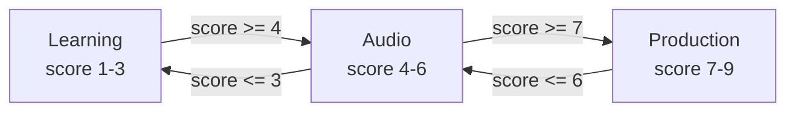
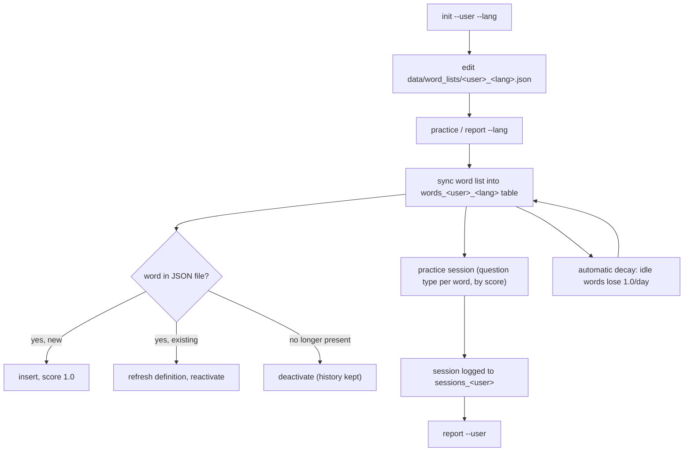

# LexiLoop

An interactive command-line tool for vocabulary practice, with a SQLite-backed
spaced-repetition scoring system. LexiLoop is **language-agnostic and
multi-user**: any user can maintain any number of word lists (one per
language or topic), each entry being a word plus an optional definition (or
multiple definitions, in any language). For example, an English word can have
both an English and a German definition, and vice versa — handy if you're
practicing a new language while reviewing in your own.

## How it works

- All data lives in a single local SQLite database (`data/lexiloop.db`).
- Each **user** has their own tables, and each **word list** (one per
  `--lang`) is its own table: `words_<user>_<lang>`.
- Every word has a **score** from `1.0` (struggling) to `9.0` (mastered),
  plus history counters (`times_practiced`, `times_correct`,
  `times_incorrect`, `times_drilled`, `times_flagged`, `times_mastered`).
- There's a single `practice` command. Each word's *current score* decides
  what kind of question it gets, Memrise-style — so a session over a mix of
  new and practiced words naturally mixes all three question types:

| Score | Gauge | Question type | On correct | On incorrect |
|---|---|---|---|---|
| 1-3 | `○○○` | **Learning** — word + definition(s) shown, type the word | `+1` | `-2` |
| 4-6 | `●○○` | **Audio** — listen only, type the word you hear | `+2` | `-2` |
| 7-9 | `●●○`/`●●●` | **Production** — definition shown + audio plays, type the word from memory | `+3` (capped at 9.0) | `-1` |

Scores are floored at `1.0`. A word with no definition always uses the
flash-and-hide spelling test for "Learning", and the listening test for
"Production" (since there's no definition to show), but still earns/loses the
points for whichever band it's in.

### Focused-batch learning

Sessions use a **focused batch** approach rather than asking each word once
and moving on. A small active batch of words (default: 4) is worked on
simultaneously. Each turn, whichever word in the batch has the **lowest
current score** is asked next (ties broken randomly). When a word reaches
score 9 it graduates and the next word from the session pool is promoted into
the batch. This continues until the session reaches 16 questions or the word
list is exhausted.



A correct answer adds points (+1 in Learning, +2 in Audio, +3 in Production,
capped at 9); an incorrect answer subtracts 2 in Learning/Audio or 1 in
Production (floored at 1) — see the table above. Either can move a word into
a neighboring band. Manual overrides jump straight to a band regardless of
score: `@` master -> 9.0 (Production), `$` drill -> 5.0 (Audio), `!` flag ->
1.0 (Learning).

- Every word left untouched for **one or more days automatically loses 1.0
  point per idle day** (floored at `1.0`), pulling neglected words back into
  easier question types — this happens automatically on every `practice`/
  `report --lang` run, no separate command needed.
- Every session is logged (date, duration, words practiced, correct/incorrect,
  drilled count) so you can review your history with `report`.

## Setup

LexiLoop is a single Python file (`lexiloop.py`), run through the
`lexiloop.sh` wrapper — don't call the `.py` file directly.

```bash
chmod +x lexiloop.sh   # one-time, if not already executable
```

### Create a word list for a user/language

```bash
./lexiloop.sh init --user bahman --lang german
```

This creates `data/word_lists/bahman_german.json` (an empty array) and the
corresponding tables in `data/lexiloop.db`. Edit the JSON file to add words,
then practice.

## Word list format

Each word list is a JSON array of `{word, definition}` objects, stored at
`data/word_lists/<user>_<lang>.json`:

```json
[
  { "word": "Haus", "definition": ["house, building", "ein Gebäude zum Wohnen"] },
  { "word": "laufen", "definition": "to run, to walk" },
  { "word": "Apfel" }
]
```

- `word` — required, the term to practice. You can give **multiple accepted
  forms** by separating them with commas, e.g. `"das Haus, die Häuser"`
  (singular + plural). All forms are shown/spoken together, and an answer is
  marked correct if it matches *any single form*, **or** if you type out all
  the forms together exactly as shown (in the same order) — spacing around
  the commas doesn't matter (`"a, b"`, `"a,b"` and `"a , b"` are all
  equivalent), and matching is case-insensitive.
- `definition` — optional. Can be a single string, a list of strings (each
  shown on its own line), or omitted entirely for plain spelling practice.
  Definitions can be in any language(s) you like — there's no fixed pairing.

> **Note:** the "Learning" and "Production" question types only do anything
> useful for words that *have* a non-empty `definition`. A word with no
> definition always falls back to the plain flash-and-hide spelling test for
> "Learning", and to the listening test for "Production" (no definition to
> show). For the best experience, give every word at least one definition.

Sample lists are included for user `bahman`. A single user can have as many
word lists as they like — the `--lang` value (or **Word list** field in the
web UI) is just a label, not a fixed language name. Use any name that makes
sense to you (e.g. `german_home`, `english_b2`).

**Starter lists (hand-curated):**
- `data/word_lists/bahman_english.json` — 20 A1 English words with
  English-only definitions.
- `data/word_lists/bahman_german.json` — 20 A1 German words (with articles
  and plural forms) and English definitions.

**Generated from the Language Learning decks**
([github.com/vbvss199/Language-Learning-decks](https://github.com/vbvss199/Language-Learning-decks)):
- `bahman_german_a1.json` — 681 German words (A1)
- `bahman_german_a2.json` — 2 060 German words (A2)
- `bahman_german_b1.json` — 6 449 German words (B1)
- `bahman_german_b2.json` — 8 288 German words (B2)
- `bahman_german_c1.json` — 2 771 German words (C1)
- `bahman_english_a1.json` — 634 English words (A1)
- `bahman_english_a2.json` — 1 694 English words (A2)
- `bahman_english_b1.json` — 4 667 English words (B1)
- `bahman_english_b2.json` — 8 549 English words (B2)
- `bahman_english_c1.json` — 4 857 English words (C1)

Each entry has the English translation and a bilingual example sentence
(German deck) or an English example sentence (English deck). German nouns are
prefixed with their article (`der`/`die`/`das`). You can regenerate or extend
these files with `utils/generate_lexiloop_json.py` — see
[Generating word lists from the source decks](#generating-word-lists-from-the-source-decks) below.

For sub-list names that don't auto-detect as a language (e.g.
`german_a1`), pass `--audio-lang german` (CLI) or fill in the **Audio
language** field (web UI) to get the correct voice.

## Generating word lists from the source decks

The source files `data/word_lists/german.json` and `data/word_lists/english.json`
come from [github.com/vbvss199/Language-Learning-decks](https://github.com/vbvss199/Language-Learning-decks)
and contain **20 280 German** and **20 708 English** words — every single one
with an English translation, a CEFR level (A1–C2), and an example sentence.
German nouns also carry their grammatical gender.

`utils/generate_lexiloop_json.py` turns these into LexiLoop-compatible JSON
files, one per CEFR level:

```bash
# Generate all CEFR levels for German
python3 utils/generate_lexiloop_json.py --lang german --user bahman

# Generate all CEFR levels for English
python3 utils/generate_lexiloop_json.py --lang english --user bahman

# One level only
python3 utils/generate_lexiloop_json.py --lang german --user bahman --cefr B1
```

Output files land in `data/word_lists/` as `<user>_<lang>_<level>.json`
(e.g. `bahman_german_b1.json`). Each entry has:
- **word** — bare word for verbs/adjectives/etc.; `der`/`die`/`das` +
  word for German nouns.
- **definition** — English translation on line 1; bilingual example
  sentence (`native sentence — English sentence`) on line 2.

To update the source decks, replace `german.json` / `english.json` with the
latest versions from the GitHub repository above, then re-run the script.

## Renewing word lists

Every time you run `practice` or `report --lang <lang>`, LexiLoop "renews"
that list from its JSON file:

- New entries are added to the table (score `1.0`, fresh history).
- Existing entries have their definitions refreshed.
- Entries removed from the JSON file are **deactivated** (excluded from
  future practice) but their score and history counters are kept — if you
  add the word back later, its history picks up where it left off.



## Commands

### Practice

```bash
./lexiloop.sh practice --user bahman --lang german
```

| Option | Description |
|---|---|
| `--user <name>` | Required. Username (lowercase letters, digits, underscores). |
| `--lang <name>` | Required. Which word list to practice (the full list identifier, e.g. `german_home`). |
| `--no-audio` | Disable speaking each word aloud. On **macOS**, audio (via `say`) is **on by default**; this flag turns it off. Has no effect on other platforms, where audio is never available. |
| `--audio-lang <lang>` | Override the language used for voice/TTS selection. Useful when `--lang` is a sub-list name like `german_home` that doesn't auto-detect as German: pass `--audio-lang german` to use the German `say` voice regardless. Accepts the same values as `--lang` (e.g. `german`, `de`). |
| `--drill` | Drill mode: every word in the session goes through the 9-repetition drill automatically, regardless of its score band. |
| `--drill-mode` | Review drill: practice your highest-scored words without changing their scores. Only `times_drilled` is incremented. Good for reinforcing words you already know well. |

Run `./lexiloop.sh practice --help` (or `report`/`init --help`) at any
time to see this same reference from the CLI itself.

#### In-session commands

| Command | Effect |
|---|---|
| `!!` | End the session early and save progress |
| `Ctrl+C` | End the session early and save progress |
| `?` | Repeat: see the word again or replay its audio |
| `+` | Replay the current word's audio |
| `!` | Flag the current word as difficult (score → `1.0`) |
| `@` | Mark the current word as known/mastered (score → `9.0`) |
| `$` | Start a strict 9-repetition drill for the current word (score → `5.0`) |

### Report

```bash
./lexiloop.sh report --user bahman [--lang german]
```

| Option | Description |
|---|---|
| `--user <name>` | Required. Username. |
| `--lang <name>` | Optional. Limit the report to a single word list. Omit to see a separate report for each of the user's word lists. |

Shows a per-day and total summary of sessions, time spent, words practiced,
correct/incorrect/drilled counts, and average time per word. With `--lang`,
this is a single table for that word list; without it, one such table is
printed per language the user has practiced.

### Init

```bash
./lexiloop.sh init --user bahman --lang german
```

| Option | Description |
|---|---|
| `--user <name>` | Required. Username. |
| `--lang <name>` | Required. Language / word list name. |

Creates an empty word list JSON file and its tables for a user/language, if
they don't already exist.

### Help

Every command and flag is also documented in the CLI itself:

```bash
./lexiloop.sh --help
./lexiloop.sh practice --help
./lexiloop.sh report --help
./lexiloop.sh init --help
```

## Project structure

```
lexiloop.py               # main script (single file)
lexiloop.sh               # run through this wrapper, not python3 directly
lexiloop_web.py           # web server (JSON API + static frontend)
lexiloop_web.sh           # run through this wrapper, not python3 directly
utils/
  make_vocab_video.py         # standalone: generate a vocab-drill video
  generate_lexiloop_json.py   # generate word lists from source decks
make_vocab_video.sh       # run through this wrapper
web/
  index.html              # frontend markup
  style.css               # Catppuccin Mocha dark theme
  app.js                  # frontend logic
data/
  lexiloop.db             # SQLite database (auto-created)
  word_lists/
    german.json           # source deck: 20 280 German words (A1–C2)
    english.json          # source deck: 20 708 English words (A1–C2)
    <user>_<lang>.json    # generated / hand-curated word lists
```

## Web UI

LexiLoop also ships with a localhost-only web UI that uses the same
SQLite database and scoring logic as the CLI - standard library only, no
`pip install` or virtualenv needed.

```bash
chmod +x lexiloop_web.sh   # one-time, if not already executable
./lexiloop_web.sh
```

This starts a server at **http://127.0.0.1:9999/** (bound to localhost
only). Open it in a browser for:

- **Practice** - the same Learning/Audio/Production question types and growth
  gauge as the CLI, with the same special commands available as buttons
  (`!!` end, `!` flag, `@` master, `$` drill, `?` reveal, `+` replay audio).
  Audio is played via the browser's built-in Web Speech API
  (`speechSynthesis`), so no `say`/macOS dependency is needed.
- **Report** - per-language daily and total summaries, same data as
  `report --user`. Add a language to also see that word list's words,
  current scores/gauges, and per-word practice stats (times practiced,
  correct, incorrect, drilled, flagged, mastered).
- **Word Lists** - see existing `<user>_<lang>` word lists, create new ones
  (equivalent to `init --user --lang`), and edit a list's words and
  definitions directly in the browser - saved straight to
  `data/word_lists/<user>_<lang>.json` and re-synced into the database.
- **About** - an overview of the project and how the CLI and web UI share
  the same database as their single source of truth.

Every page's main button doubles as the `Enter` key shortcut on its input
fields, and pressing `Enter` with a required field empty moves focus there
instead of submitting.

The theme is dark, using the
[Catppuccin Mocha](https://catppuccin.com/palette/) palette.

## Audio / pronunciation (macOS)

On macOS, every word is spoken aloud via the built-in `say` command —
enabled by default, disable with `--no-audio`.

- LexiLoop picks a `say` voice matching `--lang` when one is installed
  (e.g. a German voice for `--lang german`, a French voice for
  `--lang french`), so words are pronounced in their own language rather
  than read with the system default voice's accent. If no matching voice is
  found, the system default voice is used.
- **English** (`--lang english`/`en`) always uses the **system default
  voice** — no `-v` override is applied.
- **German** (`--lang german`/`deutsch`/`de`) prefers the best installed
  "Anna" variant, in order: `Anna (Premium)` > `Anna (Enhanced)` > `Anna`.
  Whichever of these is installed (check with `say -v '?' | grep -i anna`)
  is used.
- For all other recognized languages, LexiLoop falls back to the first
  installed voice matching the locale prefix (e.g. first `fr_FR` voice for
  `--lang french`).
- Recognized `--lang` names for voice matching include `english`, `german`/
  `deutsch`, `french`/`francais`, `spanish`/`espanol`, `italian`, `dutch`,
  `portuguese`, `russian`, `japanese`, `chinese`, `korean`, `turkish`,
  `polish`, `swedish`, `norwegian`, `danish`, `arabic`, or their two-letter
  codes (`en`, `de`, `fr`, ...). Any other `--lang` value still works for
  practice — it just falls back to the default voice for audio.
- **A note on voice quality:** macOS's System Settings -> Accessibility ->
  Spoken Content "Voice 1-4" picks (Siri/personal voices) are *not*
  addressable by name from the command line. This is different from
  downloadable premium voices like `Anna (Premium)`, which **are**
  addressable via `say -v "Anna (Premium)"` and are what LexiLoop uses for
  German when installed.
- During the `$` 9-repetition drill, the word is spoken before **every**
  repetition, not just once — useful for repeated listen-and-spell practice.
- In the "Learning" and "Audio" question types, the word is spoken when the
  prompt appears (before you answer); pressing `?` replays the audio and
  briefly shows the word on screen, in case you need to look at it.

## Color-coded German genders

For words that start with a German article, LexiLoop colors the word
according to its grammatical gender wherever it's displayed:

| Article | Gender | Color |
|---|---|---|
| `der ...` | masculine | blue |
| `die ...` | feminine | red |
| `das ...` | neuter | green |
| (no article / verbs, adjectives, other languages) | — | green |

> **Tip:** as any good German teacher will tell you, always learn a noun
> *together with* its article (`der`/`die`/`das`) and its plural form —
> guessing the gender or plural later is much harder than memorizing them
> from the start. To take advantage of this, write your German nouns in
> `word_lists/<user>_german.json` with the article included, and add the
> plural form as a second, comma-separated form in the same `word` field
> (e.g. `"das Haus, die Häuser"`). Both forms are shown and spoken together,
> and typing either one (singular or plural) counts as correct. The bundled
> `bahman_german.json` list is set up this way as an example, and the color
> coding above will then show you the gender at a glance during practice.

## Requirements

- Python 3 (standard library only, no external dependencies)
- macOS gets spoken-word audio for free (via the built-in `say` command),
  enabled by default. Use `--no-audio` to turn it off. On Linux/Windows,
  audio is simply unavailable (the flag has no effect either way).

## Everyday practice commands

The same `--lang` flag switches the whole session between word lists — use
`--lang german` or `--lang english` (or any other list you've `init`'d) with
any of the commands below. There's just one command: `practice`. The
question type for each word is chosen automatically from its score (see
[How it works](#how-it-works) above), so new words get "Learning" questions,
words you're getting right move to "Audio" then "Production" questions, and
words you get wrong (or leave idle) drift back down.

```bash
# Practice session, German
./lexiloop.sh practice --user bahman --lang german

# Practice session, English
./lexiloop.sh practice --user bahman --lang english

# Silent session (e.g. in a quiet office) — disables macOS audio
./lexiloop.sh practice --user bahman --lang german --no-audio

# Check today's and overall progress for a language
./lexiloop.sh report --user bahman --lang german

# Check progress across all of a user's word lists
./lexiloop.sh report --user bahman

# Add a new word list (e.g. for a new language or topic)
./lexiloop.sh init --user bahman --lang french
```

## Vocab drill video (optional side feature)

`utils/make_vocab_video.py` is a standalone script that turns one of your
word lists into a video: each word is shown (with its meaning) on a dark grey
background while the audio is spoken several times in a row, so you can
review a list "Memrise-flashcard" style in a video player. It's independent
of the CLI/web UI and doesn't touch the database.

```bash
chmod +x make_vocab_video.sh   # one-time, if not already executable

# Simple list — output goes to videos/bahman_german.mp4
./make_vocab_video.sh --user bahman --lang german

# Sub-list with audio language override (same pattern as practice --audio-lang)
./make_vocab_video.sh --user bahman --lang german_home --audio-lang german

# Quick test: first 5 words only
./make_vocab_video.sh --user bahman --lang german --number 5

# Custom output path
./make_vocab_video.sh --user bahman --lang german --output ~/Desktop/german_drill.mp4
```

Each word is repeated (default `4` times), with a 1-second hold between
repeats. Between words there's a 2-second gap showing only the background
(no text), to mark the transition to the next word.

The flags match the `practice` command wherever applicable:

| Option | Description |
|---|---|
| `--user <name>` | Required. Whose word list to use. |
| `--lang <name>` | Required. Word list name (e.g. `german_home`). |
| `--audio-lang <lang>` | Override the language used for voice selection. Same as `practice --audio-lang`: use this when `--lang` is a sub-list name like `german_home` that doesn't auto-detect as a language. |
| `--number <n>` | Only include the first `n` words (useful for a quick test). |
| `--output <path>` | Output video file (default: `videos/<user>_<lang>.mp4`). |
| `--word-list <path>` | Override the word list path (default: `data/word_lists/<user>_<lang>.json`). |
| `--repeats <n>` | How many times to say each word (default: `4`). |
| `--speed <factor>` | Audio speed, e.g. `0.8` for slower, `1.2` for faster (default: `1.0`). |

### Requirements

This script is standard library only (no `pip install`/virtualenv needed),
but it shells out to `ffmpeg`/`ffprobe` and (on macOS) `say` — so it needs a
build of **ffmpeg with the `drawtext` filter** (requires `libfreetype`).
Homebrew's default `ffmpeg` formula does **not** include this; you need
`ffmpeg-full` instead:

```bash
# macOS (Homebrew) — ffmpeg and ffmpeg-full conflict, so remove ffmpeg first
brew uninstall ffmpeg
brew install ffmpeg-full

# Debian/Ubuntu — the apt ffmpeg package includes drawtext by default
sudo apt-get install ffmpeg
```

Check with `ffmpeg -filters | grep drawtext` — if that prints a line, you're
good to go. Audio uses the same `say` voice selection as the CLI (see
[Audio / pronunciation](#audio--pronunciation-macos)); on other platforms, no
audio is generated.
