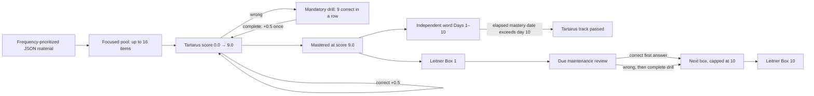

# Tartarus

Tartarus is a local-first active-recall engine for learning English and German vocabulary and sentences from user-owned JSON material.

Its design principle is simple to state and, unusually, actually enforced by the code: **the learner is never asked to make a decision that isn't "what do I already know."** No mode picker, no "which file," no "should I review or learn new material" — Tartarus decides all of that from saved state, and the scoring math is built so that persistence is always rewarded and never punished. See [What you can rely on](#what-you-can-rely-on) below for the specific guarantees, each backed by a test in `utils/test_tartarus.py`.

The project deliberately keeps **learning content** and **learner state** separate:

- JSON under `data/word_lists/` is the source of truth for words, sentences, definitions, ordering, and metadata.
- SQLite stores users, per-item progress, session history, Leitner state, and append-only mastery milestones that anchor each word's Consolidation Track schedule.
- The Web UI is served by a small, OS-agnostic Python localhost server — no macOS dependency to run it.
- Bundled content plays from a pre-generated pronunciation database (`data/audio/`), so audio works the same way regardless of the server's or the browser's OS. Personal/custom lists, which have no pre-generated audio, fall back to live synthesis via macOS `say` where available.

The core idea is simple: keep a small set of material in focus long enough to push it toward mastery, avoid unnecessary context switching, and then maintain mastered material with spaced repetition.

---

## What you can rely on

These are the guarantees the engine is built to hold — each one is exercised by the test suite, not just described here.

- **There is no "which file" decision.** Pick a language, a level, and a part of speech; the exact word list resolves automatically. If more than one file could ever match, it's resolved the same deterministic way every time — there is nothing left for you to click.
- **Nothing you earn is ever lost, and nothing ever regresses.** A word's score only ever moves up, in fixed `0.5` steps from `0.0` to `9.0`, or stays exactly where it was. A wrong answer never lowers a score, never demotes a Leitner box, and never resets a Consolidation Track day. Its only cost is a bounded corrective drill — nine consecutive correct repetitions — before that item's forward progress resumes exactly where it left off.
- **Progress carries across days untouched.** A word that reaches band 5 today resumes at band 5 tomorrow, not band 0. When it crosses band 9, its own mastery date starts its independent 10-day reinforcement track and it enters Leitner Box 1 in the same atomic database update.
- **Finishing Encoding is deterministic, not a matter of luck.** The Encoding pool contains every active word below band 9. It remains available until every word reaches band 9, with no daily session cap. A mastered word leaves Encoding immediately and begins its own reinforcement schedule; it does not wait for the rest of the file.
- **A word's Consolidation Track stage comes only from completed reinforcement steps, never elapsed calendar time.** Each word carries its own `consolidation_step` (0–10), incremented by exactly one on a genuine reinforcement completion. Missing any number of calendar days never skips a step or drops the word from the track early — it simply waits at its last completed step until the learner returns.
- **A session never mixes question modes.** Cued Recall, Effortful Retrieval, Free Recall, Reconsolidation, Automaticity, Spaced Maintenance, and Encoding each present differently (masking, audio, timer); a session draws from exactly one of them, even if that means ending with fewer than 16 questions. Different cohorts can sit at different stages in the same file, but never inside the same session.
- **Due work always comes before new work, and no due pool can starve another.** `select_practice_words()` is the one function the Web server uses to decide what's next. Every due pool — each Consolidation Track stage, and Spaced Maintenance — is compared by how long it's been waiting, and the longest-waiting pool goes next; ties favor reinforcement's scaffolded presentation over Leitner's unscaffolded pure recall, then the earlier stage. Either one still always outranks starting brand-new Encoding material.

Together these guarantees make the selected file self-scheduling: there is no fragile file-wide day counter, no waiting for the slowest word before reinforcement starts, no way to rush a word's ten calendar days, no way for a large reinforcement backlog to starve overdue Leitner review (or the reverse), and no way for Encoding to crowd out either.

---

## Core learning model

Tartarus has two connected learning tracks:

1. **Tartarus / the 10-Day Consolidation Track** — acquisition and progressively harder recall.
2. **Lifetime Spaced Maintenance** — spaced repetition for items that have reached Tartarus mastery.

They are presented through one Web entry point: **Enter the Consolidation Track**. The learner does not manually choose between separate Tartarus and Leitner modes in the Web UI; the backend decides what the next session needs to be from the saved progress of the selected list.


```mermaid
flowchart LR
    JSON["Frequency-prioritized JSON material"]
    FOCUS["Focused pool: up to 16 items"]
    SCORE["Tartarus score 0.0 → 9.0"]
    DRILL["Mandatory drill: 9 correct in a row"]
    MASTER["Mastered at score 9.0"]
    DAILY["Independent word Days 1–10"]
    DAY11["Tartarus track passed"]
    BOX1["Leitner Box 1"]
    DUE["Due maintenance review"]
    NEXT["Next box, capped at 10"]
    BOX10["Leitner Box 10"]

    JSON --> FOCUS
    FOCUS --> SCORE
    SCORE -->|"correct +0.5"| SCORE
    SCORE -->|"wrong"| DRILL
    DRILL -->|"complete: +0.5 once"| SCORE
    SCORE --> MASTER
    MASTER --> DAILY
    DAILY -->|"elapsed mastery date exceeds day 10"| DAY11
    MASTER --> BOX1
    BOX1 --> DUE
    DUE -->|"correct first answer"| NEXT
    DUE -->|"wrong, then complete drill"| NEXT
    NEXT --> BOX10
```

### Why the focus pool works this way

Normal Tartarus practice uses **at most 16 unique items per session**. Selection and presentation are deliberately separate operations.

#### 1. Select the focus pool

For unfinished items (`score < 9.0`):

1. Higher score is selected before lower score.
2. Equal-score items are ranked by their position in the JSON file.
3. Only the first 16 selected items enter the session.

This keeps near-mastery material in focus instead of constantly replacing it with unrelated new material.

For a completely new file every item has score `0.0`, so the first 16 items in JSON order are selected. The bundled datasets are curated in priority/frequency order, so **JSON order is pedagogically meaningful**.

#### 2. Randomize presentation without destroying priority

After the 16-item pool is chosen, Tartarus randomizes **only items that have the same score**. Different score bands remain in descending-score order.

That gives two benefits at once:

- the learner remains concentrated on the same high-priority material across sessions;
- the exact sequence changes, reducing blind memorization of list position.

Once one focused item reaches score `9.0`, it leaves the unfinished pool and the next eligible JSON-priority item can enter.

---

## Tartarus score progression

Every practice item uses the same score scale:

```text
0.0 → 0.5 → 1.0 → … → 8.5 → 9.0
```

- `0.0` = new.
- `9.0` = Tartarus mastered.
- A correct normal answer adds `0.5`.
- A wrong normal answer **does not lower the score**.
- A completed normal corrective/manual drill adds `0.5` exactly once.
- Scores never exceed `9.0`.

The score also controls how much support the learner receives during the acquisition path.

### Progressive recall in Encoding

For scores below `8.0`, the target is progressively masked as the score rises. The mask is freshly randomized, so the learner cannot rely on one fixed visual pattern.

At scores `8.0–8.5`, the item moves to production-style recall: the target is hidden and the learner must reproduce it from the prompt/definition and available audio.

The purpose is gradual cue removal: recognition support is strongest when material is new and weakest near mastery.

Once this masking becomes active (`score > 0`), the definition's example-sentence line is withheld -- it always embeds the literal target word, so showing it next to a partially masked word would give the answer away. At `score == 0` the target is still shown in full, so both definition lines show as usual.

---

## Answer contract

Tartarus uses exact, case-sensitive answer matching.

### Vocabulary entries with multiple forms

A comma-separated vocabulary entry is **one learning target containing several required forms**.

For example:

```text
das Buch, die Bücher
```

The learner must provide that complete literal target exactly:

```text
das Buch, die Bücher
```

Any variation is invalid, including reordered forms, partial forms, or extra whitespace:

```text
die Bücher, das Buch
das Buch
die Bücher
Buch
das Buch, die Bücher<space>
```

Case, spelling, punctuation, spaces, articles, commas, and form order all matter.

This is how German noun singular/plural material is represented. The comma does not split the entry into interchangeable answers.

### Sentence entries

Sentence material follows the same exact literal contract. Leading or trailing whitespace is not trimmed, and commas remain required punctuation.

---

## Corrective drills

A wrong answer immediately starts a mandatory corrective drill for the same item:

```text
9 consecutive correct repetitions
```

- A wrong drill repetition resets only the drill streak to zero.
- The original mistake never lowers the Tartarus score, Consolidation Track day, or Leitner box.
- Normal End/Escape/cancel controls cannot bypass an active drill.
- The obligation is durable (`pending_drills`), not just in-memory: a browser refresh, server restart, or crash resumes the exact same word at the exact same streak instead of losing it. No forward transition is awarded and no earned progress is erased either way -- resuming just means the debt survives instead of silently vanishing.

Completing the drill grants exactly the transition that a correct first answer would have granted:

- during acquisition, the score increases by `0.5` once, capped at `9.0`;
- during Days 1–10, the item is completed for its current per-word reinforcement day;
- during due maintenance, the item advances one Leitner box, capped at Box 10.

The Effortful Retrieval stage normally requires two consecutive productions. If either production is wrong, that item escalates to the standard nine-consecutive-correct corrective drill.

### No Sisyphus loop

Mistakes add finite corrective work; they do not send the learner backward. Historical incorrect-answer counts are reporting facts, not a queue of unfinished punishment. The only reset caused by a mistake is the current drill streak. Once the nine-answer drill is completed, the learner resumes from the progress already earned.

---

## The 10-Day Consolidation Track

Consolidation Track reinforcement is scheduled independently for each mastered word, driven by each word's own `consolidation_step` (0–10) rather than elapsed calendar time -- so one file can contain Encoding words, several reinforcement stages, and long-term-review words at the same time, and a learner who misses days never loses a step, just picks up where they left off. `mastery_events.mastered_date` remains an immutable audit record of when each word first reached score 9, but no longer drives which stage it's on.

The roadmap has six stages across days `0–10`:

Audio is never muted in any stage: every question's prompt plays
automatically the moment it's shown, and Replay always works, from Day 0
through Automaticity.

| Stage | Day(s) | Recall presentation | Prompt audio | Timer |
| --- | ---: | --- | --- | ---: |
| **Encoding** | 0 | score-driven progressive learning/production | automatic | none |
| **Cued Recall** | 1–2 | target shown with vowels masked; primary definition visible | automatic | none |
| **Effortful Retrieval** | 3–4 | target hidden; primary definition visible; 2 consecutive correct repetitions | automatic | none |
| **Free Recall** | 5–6 | target hidden; primary definition visible | automatic | 0.75 s / character |
| **Reconsolidation** | 7–8 | target hidden; primary definition visible | automatic | 0.5 s / character |
| **Automaticity** | 9–10 | target hidden; primary definition visible | automatic | 0.5 s / character |

Bundled definitions always carry the primary meaning as their first line and
an example sentence as their second (see
[data/DATASET_SCHEMA_GUIDE.md](data/DATASET_SCHEMA_GUIDE.md)), and that
example sentence always embeds the literal target word. So whenever the
target itself is masked or hidden -- Encoding once its own progressive
masking is active (`score > 0`), every stage above, and Spaced Maintenance --
the example-sentence line is withheld and only the primary meaning line is
shown; otherwise the answer would just be sitting in plain text one line
below the masked/hidden word. The one exception is a corrective drill that
has actually revealed the word (`show_word: true`, after a genuine mistake):
at that point the answer is already fully shown, so the full definition
(example sentence included) is restored there, since it can only help.

Free Recall/Reconsolidation/Automaticity's response timer scales with the target's own length
rather than a fixed guess -- 0.75s per character for Free Recall, 0.5s per
character for Reconsolidation and Automaticity's harder silent recall. It starts the
moment the question is shown, not after the prompt audio finishes. It
freezes the instant an answer is submitted, correct or not, but stays
visible exactly where it stopped rather than disappearing; only a
genuinely new question clears it and starts a fresh one.

### Day 0: acquisition gate

The Encoding pool contains active items with `score < 9.0`. Sessions use the focused 16-item selection described earlier. Each item leaves this pool as soon as it reaches score `9.0`; reinforcement for that item does not wait for every other item in the file.

### Days 1–10: deterministic consolidation, driven by completed steps

A mastered word becomes eligible for Day 1 on a later calendar date. Its current day is always one past the last step it actually completed (`consolidation_step + 1`), not a count of elapsed calendar days -- missing a week doesn't skip anything or push the word past day 10 early; it just waits at its last completed step. One correct first answer or a completed corrective drill records that word as completed for today, advancing its `consolidation_step` by exactly one; another same-day session will not serve it again, and a duplicate or retried completion request cannot double-advance the same day's step.

Words mastered on different dates remain separate cohorts, each tracked independently. A **session never mixes stages**: due cohorts across every Consolidation Track stage (and Spaced Maintenance) are compared by how long each has been waiting, and only the longest-waiting single stage is served in that session -- never a blend of, say, Cued Recall and Effortful Retrieval items in the same 16-question batch, even if both are due. Once a word completes its tenth reinforcement step, it leaves Consolidation Track reinforcement and remains in Spaced Maintenance only. A mistake never changes a word's completed-step count or sends it backward.

### Session completion

A normal Web session contains up to 16 unique questions. One correct answer does **not** end a 16-question session; the session advances question by question until the current queue is complete or the learner ends it early.

An early-ended session keeps every item transition already recorded. Unanswered queue entries remain due; there is no session-wide advancement state to grant or void.

---

## Lifetime Spaced Maintenance

Reaching score `9.0` places an item into **Leitner Box 1**, in the same step that starts its Consolidation Track reinforcement track. The two tracks are independent from that point on: completing a Consolidation Track reinforcement check-in never advances or satisfies a due Leitner review, and vice versa. This means a word can be legitimately due for both a reinforcement check-in and a Leitner review on the same calendar date -- that's confirmed, deliberate behavior, not a bug (a session never serves both at once, per the no-mixed-session rule above; `select_practice_words()`'s fairness comparison picks one).

Tartarus uses ten boxes:

| Box | Review interval |
| ---: | ---: |
| 1 | 1 day |
| 2 | 2 days |
| 3 | 3 days |
| 4 | 4 days |
| 5 | 5 days |
| 6 | 6 days |
| 7 | 7 days |
| 8 | 8 days |
| 9 | 9 days |
| 10 | 10 days |

A mastered item is due when the number of days since `leitner_last_reviewed` reaches the interval for its current box.

Due Leitner material is serviced through the **same Enter the Consolidation Track flow**: starting a session is the only decision a learner makes. Due per-word reinforcement is served first (it's a scaffolded warm-up before Leitner's unscaffolded pure recall), due Spaced Maintenance next, and only once neither has anything due does the same entry point continue with new Encoding material — there is no separate Web "Review due" workflow, and no way to skip ahead of either due track by choosing to practice something else. This holds regardless of how much Encoding work remains, so review of already-mastered material is never starved by a large list still being learned.

For a mastered item:

- a correct first answer keeps the score at `9.0` and advances the box by one, up to Box 10;
- a wrong first answer keeps the box unchanged until the mandatory nine-correct drill is completed, then advances it by one;
- a same-day repeat does not repeatedly advance the Leitner box;
- a completed due review always advances exactly once unless the item is already in Box 10;
- Box 10 remains the terminal maintenance box; its base interval is 10 days, though a demonstrated history of successful Box 10 reviews can extend it (below).

Practice setup shows this as a horizontal square-box roadmap beside the 10-Day Consolidation Track roadmap, both in the live report.

### Extended Box 10 intervals for demonstrated retention

A large, long-lived vocabulary can leave hundreds of items sitting in Box 10, each needing review every 10 days indefinitely, even after dozens of consecutive correct recalls -- diminishing-returns maintenance that crowds out time better spent on weaker or newer material. `leitner_maintenance_streak` counts consecutive successful reviews *while already at Box 10* (arriving at Box 10 for the first time does not itself count) and progressively extends that item's own interval, capped at 30 days:

| Box 10 streak | Review interval |
| ---: | ---: |
| 0 - 2 | 10 days |
| 3 - 4 | 20 days |
| 5+ | 30 days (ceiling) |

This never regresses on a mistake, matching the engine's core invariant that a wrong answer costs a bounded corrective drill rather than lost progress: a wrong first answer freezes the streak exactly where it is (same as the box itself) and starts the standard corrective drill; completing that drill grants the streak its deferred `+1`, precisely mirroring how a completed drill already grants the same box advancement a correct first answer would have. There is no reset or decrease path -- only Boxes 1-9's own fixed intervals and a freshly-arrived Box 10 item (streak 0) ever use the plain 10-day cadence by default.

A due maintenance review hides the target the same way Effortful Retrieval onward does, so it shows only the primary definition line too -- the example sentence, which always embeds the literal target word, is withheld for the same reason.

When more items are due than fit in one 16-item session, `maintenance_ready_words()` always works from the lowest box up -- Box 1 (least stable, most urgent) before Box 2, and so on through whichever box is due last -- regardless of where those items sit in the file. Box number is the only priority signal; file order only breaks ties within the same box.

### Engine invariants

Any scoring or session change must preserve these contracts:

1. Tartarus score never decreases and never exceeds `9.0`.
2. Leitner boxes never decrease and never exceed Box 10.
3. Reaching score `9.0` enters Box 1; it does not skip directly to Box 2.
4. Every completed due maintenance review advances exactly one box unless already at Box 10.
5. A wrong answer cannot receive its forward transition until the mandatory drill is completed.
6. Completing a drill grants exactly one transition; it cannot double-advance the item.
7. A completed review updates `leitner_last_reviewed`, preventing same-day repeated advancement.
8. Per-word Consolidation Track completion and Leitner advancement are independent transitions.
9. Historical mistakes are reporting data, not outstanding drill debt.
10. A list is `learning_complete` only when the Consolidation Track is terminal and every active item is in Box 10.

---

## Supplementary practice tracks

Three additional, per-file practice tracks live in their own **Supplementary practice (optional)** card on Practice setup, visually separate from the required Consolidation Track flow above it -- these are extra repetition, not part of the graded path, and never touch score, Leitner box, or `consolidation_step`:

- **Encoding Practice** -- targets items still below band 9 (falling back to the whole file, in file order, once none are). The word is always shown in full, dim like the main Encoding stage but never masked -- this is a typing/copying exercise for initial encoding, not a recall test. Both definition lines are shown.
- **Reading Retrieval** -- targets mastered (band 9) items only. Shows just the primary definition; the target is fully masked, same as normal recall. Audio stays silent while the question is shown -- there's a definition to read -- and plays after every answer is submitted, right or wrong.
- **Listening Retrieval** -- targets mastered (band 9) items only. No text or definition is shown at all; audio is the only stimulus, so unlike Reading Retrieval it plays automatically the moment the question is shown, same as every other stage.

All three share one mechanic on a wrong answer: no corrective drill, ever -- the same question just repeats with unlimited retries until it's typed correctly. These are optional practice, not the mandatory Consolidation Track, so there's no drill debt to work off. On Reading/Listening Retrieval specifically, the *first* miss also reveals the word immediately -- full Encoding-style presentation, unmasked with both definition lines -- rather than leaving the learner to keep guessing blind; a blind guess after a miss isn't productive, so every attempt after that is a guaranteed-achievable copy instead of more guesswork. A second miss on the same item doesn't reveal again (already revealed); Encoding Practice never reveals at all, since it's already fully visible from the start.

Each of the three is bucket-backed, not calendar-due-backed: a persisted "bag of tiles" (`practice_bucket`) draws items without replacement until every eligible item for that track has been served once, then refills and starts a new cycle. This makes each track endless -- a session ends at 16 questions (or the file's full eligible count, if smaller), and a learner can start another session in the same track immediately, indefinitely. A session can be cancelled at any time -- with no drill to protect, there's nothing that can ever block it. Practiced/correct/incorrect counts and session time are all recorded normally and count toward the file's totals in reporting, just tagged with the track's own name instead of a Consolidation Track stage.

---

## Speech and interaction model

Bundled content plays from `GET /api/audio`, which reads pre-generated pronunciation out of a per-list SQLite database (`data/audio/`, one file per bundled word list) and streams it to the browser — this works the same way regardless of the server's or the browser's OS. Personal/custom lists have no pre-generated audio; for those, `speak()` falls back to the macOS `say` command when available.

Speech rate is fixed, not user-configurable (pre-generated audio is baked in at generation time; the `say` fallback matches it for consistency):

```text
128 words per minute
```

The Web UI serializes speech so two speech requests do not overlap.

### During prompt speech

The learner may **type into the answer field while the prompt is being spoken**. This is the only interaction intentionally kept available during prompt speech.

Until speech finishes:

- Submit/Enter does not submit the answer;
- action buttons are disabled;
- replay and end actions are blocked;
- navigation between Web views is blocked;
- the card does not change.

The typed text remains in the input when speech finishes, then normal submission/actions are restored.

After an answer is submitted, the UI remains interaction-locked while the answer request, any feedback speech, and the card transition complete.

### Audio is never muted

Every stage -- Encoding through Automaticity -- plays its prompt automatically
and Replay is always available. Audio is never disabled based on which
stage a question is in. Where result feedback speech is enabled, the
current target is spoken before the next card advances.

Bundled-content audio is unaffected by the host OS. For personal/custom lists on systems without macOS `say`, the application remains usable; `/api/tts` reports speech as unsupported and the browser continues without audio for that content.

---

## Web UI

Start the local server:

```bash
make web
```

Then open:

```text
http://127.0.0.1:9999/
```

The Web UI has five views.

### Practice

The practice selector follows:

```text
User → Language → Level → Part of speech
```

That's the whole decision. Once a part of speech is picked, the exact word list resolves automatically — there is no separate "which file" step to click through, and each dropdown option already shows the word count it resolves to (e.g. `NOUN (381)`), so the choice is never a leap in the dark.

Current categories are:

- English vocabulary
- English sentences
- German vocabulary
- German sentences

The selected list shows:

- counts in Encoding, each active reinforcement stage, and long-term review;
- the six-stage 10-Day Consolidation Track roadmap;
- the horizontal ten-box Lifetime Leitner roadmap;
- one **Enter the Consolidation Track** action.

During a session, Replay is always available, and End is available only outside a mandatory drill. There are no reveal, flag, mastery, or manual-drill shortcuts.

When the selected list has no due maintenance, due reinforcement, or Encoding work, **Enter the Consolidation Track** is disabled. Completed same-day reinforcement is not reopened, and no mutable day counter can be advanced early.

The global Enter shortcut is also part of the flow:

1. after a session summary, Enter returns to setup;
2. Enter again starts the next selected session.

### Report

There is no separate Report page. The same cascade that starts a session --
`User → Language → Level → Part of speech` -- also drives a live report
rendered directly on Practice setup, below the start buttons: selecting only
a user shows the full cross-list report; adding language/level/part-of-speech
narrows it to one file's focused report. It updates automatically as the
cascade changes, with no separate view to switch to and no "Load report"
click -- just pick material, the numbers are already there.

The report itself exposes session statistics, current mastery distribution
(as percentages, never raw counts or internal list IDs), Consolidation Track
progress, the horizontal Leitner roadmap, hard/Nemesis items, and the backup
controls (Create user, Export DB, Import DB, Fill Practice Gap), which live
in the same setup card. Focused reports also show cumulative mastery and
Box-10 milestone charts backed by append-only database events. Material
mastered before milestone tracking may begin later on a chart because
Tartarus never invents missing historical dates.

**Fill Practice Gap** brings a user's practice records up to today, so an absence or an unfinished day doesn't leave permanent overdue debt behind. It first decides whether there is a gap at all. A gap is either of two situations:

- **a missed day** — at least one whole calendar day passed with no practice (the most recent practice is older than yesterday); or
- **unfinished learning** — the learner practiced as recently as yesterday but still has outstanding work: material below mastery in Encoding, a due Consolidation Track step, or a due Spaced Maintenance review.

If either holds, one click closes the gap completely: every one of that user's practice-record dates moves forward together by the same number of days — each word list's `last_practiced`/`last_tartarus_completed`/`leitner_last_reviewed`, mastery milestone dates, session-log dates, and any pending drill's date — landing the most recent one exactly on today. Nothing about *what* was practiced or *how much* progress was made changes, and the spacing between dates is preserved exactly; the whole history shifts forward as a block, so the covered days read like days that were practiced through rather than a gap.

Practicing today is always a no-op regardless of outstanding work — the records are already current, so there is nothing a shift could usefully do. A user who has never practiced is a no-op too. In those cases nothing happens at all: no backup, no transaction, no changes.

It stays safe to click repeatedly because the shift is defined by the distance to today rather than a fixed step: once the records are current, the next click finds no gap and does nothing.

Because this mutates real history, it's deliberately layered with more caution than any other button in this app. The shift distance is measured from the latest date held in *any* column being moved — not from `last_practiced` — so, since every shifted value is by definition no later than that maximum, adding the distance to today cannot leave any single value dated beyond today; "never produce a future-dated record" is therefore a property of the arithmetic itself rather than something the caller has to get right. On top of that: existing data is validated against SQLite's own date parser first (a value it can't parse would otherwise be silently wiped rather than shifted, so this refuses instead); the whole decision is recomputed a second time immediately after acquiring the write lock, so two overlapping calls for the same user — two tabs, a double-click — can never double-apply a shift, and because each call recomputes its own distance from the state it actually observes, two racing shifts can never sum to more than the distance to today; and the actual result is checked against today one more time right before committing, independent of everything else, refusing and rolling back the whole transaction if it would ever produce a future-dated record. A verified backup is taken automatically whenever it does shift something. This is a deliberate, explicit, confirmed action confined to Practice setup.

### Today's Overview

A per-user overview of the day's practice, separate from Practice setup's cascade-driven report, split into two cards.

**Due today** is forward-looking: every word list with a reinforcement due count, a Spaced Maintenance due count, or remaining Encoding material greater than zero lists its own row -- the same per-file `consolidation_state_breakdown()` counts the Practice roadmap already computes, reused here as a one-user cross-file view instead of one-file-at-a-time. A file that's fully caught up (nothing due, nothing left in Encoding) is excluded rather than padding the list with an all-zero row, and the remaining rows sort with the most outstanding work first.

**Practiced today** is a historical record: every `(file, mode)` combination actually practiced today lists its own row -- file, mode (e.g. "Cued Recall"), words completed, accuracy, and time spent -- sourced from the same per-session history (`sessions_<user>`) the Report view reads, grouped by file and mode instead of by calendar day. Sessions are grouped by mode alone, not by the session log's `stage` column -- that column is the Consolidation Track *stage index* (1-5), a 1:1 redundant function of mode, not a calendar day, so it's never shown as one.

Each row on either card has a **Practice →** button that jumps straight to that file on Practice setup with the cascade already resolved.

Accuracy is first-attempt accuracy (`correct / (correct + incorrect)`), the same formula the Report/Dashboard views already use — deliberately not a fraction of words completed, since a stage like Effortful Retrieval routes every clean completion through its own drill counter rather than "correct," which would otherwise make a mistake-free row misleadingly read as 0%.

### Word Lists

The editor uses the same selector:

```text
User → Language → Level → Part of speech
```

Editing a shared list creates a user-owned override rather than modifying the bundled shared JSON. Saves are atomic and preserve fields that the editor does not intentionally change. A **Restart progress for this list** action is available once a list is loaded — it zeroes that list's scores and Leitner boxes and clears its mastery milestones for a fresh Encoding pass, while leaving session/time history untouched as a record. It's a deliberate, explicit action confined to this management view, not something exposed in the daily Practice flow.

### About

The About view documents the in-app interaction model and learning controls.

---

## Dataset organization

Bundled material lives under:

```text
data/word_lists/<language>/<kind>/<level>/<file>.json
```

One file per `(language, kind, level, part-of-speech)` combination — part of speech is encoded in the filename, not a directory level, since a directory holding exactly one file added nothing. The repository contains English and German vocabulary and sentence material across CEFR levels up to C2; exact level and part-of-speech coverage follows the available source material.

Examples:

```text
data/word_lists/german/vocabulary/a1/german_noun_a1.json
data/word_lists/german/sentences/a1/german_sentences_noun_a1.json
data/word_lists/english/vocabulary/b2/english_verb_b2.json
```

The filename stem is the list id used by the API, for example:

```text
german_noun_a1
```

Every bundled item carries a stable, explicit `id`, frozen ahead of an earlier corpus consolidation (many numbered `partNN` files per group were merged into the single file above, in part-number order, so the merge changed no word's learner-progress identity). See [data/DATASET_SCHEMA_GUIDE.md](data/DATASET_SCHEMA_GUIDE.md) for the complete schema, naming rules, ordering semantics, personal overrides, stable IDs, and examples.

---

## Personal lists and shared material

Shared material is read from the nested `data/word_lists/` tree.

A user-owned override is stored at the root as:

```text
data/word_lists/<user>_<list-id>.json
```

For that user, a personal file with the same list id takes precedence over the shared file. Other users continue to see the shared version.

Important behavior:

- shared JSON is never rewritten when a user edits it through the Web editor;
- the first personal save persists explicit stable item IDs;
- later edits preserve those IDs;
- item order and unknown fields are preserved unless intentionally changed;
- writes use atomic file replacement;
- user/list names accept lowercase letters, digits, `_`, `-`, `.`, and `!` only.

If bundled `tartarus_sample_*` material exists, adopting personal material retires that user's sample progress/session/Consolidation Track state without modifying shared sample JSON or another user's state.

---

## Persistence model

SQLite is progress state, not the learning-content store.

Default database:

```text
data/tartarus.db
```

Per-user/per-list word tables contain:

```text
id
content_id
score
last_practiced
last_tartarus_completed
active
times_practiced
times_correct
times_incorrect
times_drilled
times_mastered
leitner_box
leitner_last_reviewed
consolidation_step
leitner_maintenance_streak
```

The current schema version is `8`.

The migration path removes obsolete review-era fields such as `drill_pending`, `times_flagged`, `last_decay_at`, and `stage_reached` while preserving legitimate progress. Schema changes are always additive and migrated on a verified copy before ever touching the live database.

Additional SQLite state includes:

- `users`;
- `sessions_<user>` practice history;
- `mastery_events` for append-only score-9 and Box-10 milestone dates used by trend reporting;
- `pending_drills` for durable mandatory-drill state.

Material removed from a JSON file is marked inactive in progress instead of silently reassigning that progress to a different item.

---

## Backups

Practice setup's backup controls can export/import a logical per-user progress backup.

Backup identity:

```json
{
  "format": "tartarus-progress",
  "version": 4
}
```

A backup includes:

- user metadata;
- all per-list word-progress rows;
- session history;
- append-only mastery and Box-10 milestone events.

Import is strict and transactional. It is a **replacement restore**, not a merge: the selected user's word progress, sessions, and milestone events become exactly the validated backup state. If validation or restore fails, the pre-import database state is rolled back. Backup versions 1–3 remain importable; obsolete file-wide Consolidation Track state is ignored because schema 5 derives reinforcement from mastery events.

Dataset JSON files are separate from progress backups and should be backed up/versioned as normal files.

---

## Configuration

Runtime configuration is environment-based.

| Variable | Default | Purpose |
| --- | --- | --- |
| `TARTARUS_DB` | `data/tartarus.db` | SQLite database path |
| `TARTARUS_WORD_LISTS_DIR` | `data/word_lists` | learning-material root |
| `TARTARUS_LOG_FILE` | `tartarus.log` | log path |
| `TARTARUS_LOG_LEVEL` | `INFO` | Python logging level |
| `TARTARUS_HOST` | `127.0.0.1` | Web bind address |
| `TARTARUS_PORT` | `9999` | Web port |
| `TARTARUS_SESSION_TTL_SECONDS` | `1800` | in-memory Web session TTL |
| `TARTARUS_MAX_ACTIVE_SESSIONS` | `100` | maximum in-memory Web sessions |
| `TARTARUS_MAX_REQUEST_BYTES` | `1000000` | maximum JSON request size |

`TARTARUS_TTS_TEST_DELAY_MS` exists only as a deterministic TTS test hook and should not be used as a production speech backend.

---

## Logging

Every backend and frontend event of note lands in one place: `tartarus.log` (rotated at 1&nbsp;MB, three backups kept). It's a plain text file — delete or truncate it any time; nothing depends on it existing between runs.

What's captured, at the default `INFO` level:

- every HTTP request (method, path, query) and every response with status `>= 400` (path, status, error message) — instrumented once at the response layer, so this covers every route automatically, not just a hand-picked subset;
- domain events: a word crossing into mastery, Tartarus/Leitner answers and drill completions, per-word reinforcement completion, word-list sync/save/import/export, and user creation/restart actions;
- frontend events, via `POST /api/client-log`: uncaught JavaScript errors and unhandled promise rejections (`window.onerror` / `unhandledrejection`), and every user-visible error message shown by the UI — so a bug surfaced only in the browser still lands in the same log as backend events.

Answer text and correct targets are deliberately excluded from every log line; only structural facts (which word, which list, correct/incorrect, resulting score/box) are recorded.

```bash
TARTARUS_LOG_LEVEL=DEBUG make web   # more verbose, if ever needed
tail -f tartarus.log                # watch it live
```

---

## Local-first security model

The default Web bind is `127.0.0.1` and is intended for local use.

The browser receives the current answer text as part of the local practice payload because reveal, speech, masking, and feedback are client-visible features. The Web API therefore follows a **trusted-local-client** model rather than a hostile-browser exam model.

Do not expose the server to an untrusted network merely by changing `TARTARUS_HOST`; there is no authentication/authorization layer designed for Internet deployment.

---

## Repository layout

```text
README.md                         project and learning-model documentation
Makefile                          common launch commands
data/
  DATASET_SCHEMA_GUIDE.md         material schema and naming guide
  word_lists/                     shared + personal JSON material
  audio/                          pre-generated pronunciation, one SQLite db per bundled list
  tartarus.db                     local progress DB (Git-ignored)
utils/
  tartarus.py                     material validation, scoring, SQLite, shared engine
  tartarus_web.py                 localhost API, sessions, Consolidation Track orchestration
  generate_audio_database.py      maintainer tool: (re)generates data/audio/ from data/word_lists/
  test_tartarus.py                unified test suite
web/
  index.html                      UI structure
  style.css                       UI styling
  app.js                          browser state, practice/report/editor behavior
```

---

## Verification

The project intentionally has one unified Python test file:

```bash
PYTHONPYCACHEPREFIX=/tmp/tartarus-pycache \
python3 utils/test_tartarus.py -v
```

Syntax checks:

```bash
PYTHONPYCACHEPREFIX=/tmp/tartarus-pycache \
python3 -m py_compile utils/tartarus.py utils/tartarus_web.py utils/test_tartarus.py

node --check web/app.js

git diff --check
make help
```

The unified suite covers the current release contracts, including:

- focused 16-item selection and equal-score shuffling;
- complete multi-form German noun answers;
- score/drill/Leitner behavior;
- Consolidation Track + Leitner dual-track roadmap;
- no-Sisyphus guarantees across acquisition, all ten daily Consolidation Track stages, and maintenance;
- Effortful Retrieval escalation from its two-production task to a nine-answer drill after a mistake;
- atomic schema-v5 migration with a verified backup and obsolete state removal;
- stable generated material IDs;
- lossless personal editor saves;
- per-user sample retirement;
- transactional backup restore;
- append-only mastery/Box-10 events, mixed per-word mastery cohorts, cumulative trend API, and inline SVG charts;
- JSON parse-cache invalidation and set-based word-list synchronization;
- calendar-derived per-word reinforcement boundaries without mutable day advancement;
- request idempotency and bounded HTTP failures;
- one-answer-does-not-end-session regression;
- Web speech interaction locking and Enter navigation;
- centered responsive practice layout;
- original six-stage roadmap presence;
- horizontal square Leitner roadmap in the live Practice report;
- report Part-of-Speech filtering;
- restart-from-scratch progress reset, preserving session history;
- corpus-wide list-id uniqueness and stable-id invariants across the whole bundled dataset;
- request/response and client-reported-error logging;
- the example-sentence line withheld wherever the target is masked or hidden (Encoding once masked, every daily stage, Spaced Maintenance), restored once a corrective drill actually reveals the word;
- extended Box 10 maintenance intervals from a demonstrated streak of successful reviews, frozen (never reset) on a miss and only ever granted via a correct answer or a completed drill;
- the single-test-file policy.

On macOS the browser contract defaults to Safari WebDriver when `safaridriver` is available. Set `TARTARUS_BROWSER=chromium` to use the headless Chromium/CDP fallback, which requires a Chromium/Chrome executable and the Python `websocket-client` module. Browser-specific tests skip only when their selected runtime is unavailable.

---

## Quick start

```bash
# inspect commands
make help

# start the Web UI
make web
```

Then open:

```text
http://127.0.0.1:9999/
```

Create a learner from the **Word Lists** view's "Create a new word list" card; everything else, including practice and reports, happens through the same Web UI.

For dataset authoring and file-layout rules, continue with [data/DATASET_SCHEMA_GUIDE.md](data/DATASET_SCHEMA_GUIDE.md).
